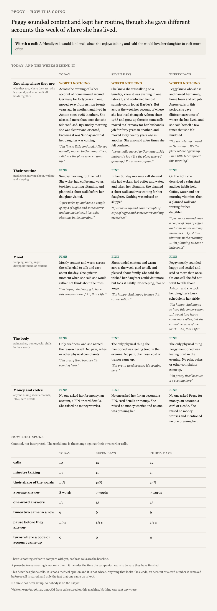

# Closer

**A voice companion for someone living alone — configured to that one person, in their language.**

*Closer, if not near.*

[](https://www.assemblyai.com/docs/voice-agents/voice-agent-api)
[](https://nodejs.org)
[](package.json)

In Italy, **2.7 million** people aged 75 and over live on their own — one
household in ten. **92.8% of them say they can count on a relative. 3.2% have
nobody.** *(ISTAT, Censimento permanente della popolazione, 2023.)*

So this is not built for the abandoned. It is built for the overwhelming
majority whose family is willing and not there: work, full days, three hours of
motorway. What is missing is not love. It is the ordinary daily contact, where
somebody would simply have noticed.

Closer speaks to that person on a day when nothing is wrong. It knows who they
are, who comes on a Thursday, and what they take in the morning. It keeps a
diary they can correct out loud. And it gives the people who love them a page —
not a transcript, and not an opinion about anyone's mind, but what changed
against that person's own usual week.

## Talk to it

**[lablab.claudiaonclaude.com](https://lablab.claudiaonclaude.com)** — the
address needs the access key that goes with it; the link in the hackathon
submission carries it. The page explains who you are playing and what to try.

It answers in the browser. The agent was built to be attached to a phone number
as well - its tools run on the server, never in the browser, so a call can use
them - but **no phone line is connected in this prototype**.

## What happens, end to end

1. **Somebody describes them in free text.** Nobody fills in a forty-field form
   about their mother; anyone can talk about her for five minutes. A form
   collects the rest — the circle, what each person may see, the routine, a
   *never mention* list, consent — and it writes nothing without the consent.
2. **That becomes a profile, and the profile becomes an agent.** The generator
   turns the text into a persona and a set of subjects worth talking about, and
   flags every field it *inferred* rather than read, to be confirmed before
   anyone talks to it. A wrong detail about someone's life is the fastest way to
   prove the system does not know them.
3. **They talk.** One subject at a time, picked by the companion rather than
   offered as a menu. Most turns end without a question, because an open
   question hands the person something to carry. It never says where it knows
   something from.
4. **It writes down what they said** — the tablets, the walk, the visit on
   Sunday — as they said it. That path is ordinary code, not a model, because
   this is the one place where inventing, inferring or rounding a number would
   be dangerous.
5. **The family opens a page.** Five indicators, each at three scales — today,
   seven days, thirty days — with the person's own words underneath, and a
   counted table of how they spoke. Only the people they named can open it, each
   with their own key, and each sees only what they were allowed to see.

<p align="center"></p>

## What it will not do

- **It does not detect anything.** It is not a medical device and does not
  audition for the part. It notices that someone who talked for nine minutes
  last week talked for two today, and tells the people who love them. It claims
  the instrument, never the discovery.
- **Nothing reaches anybody on its own.** No alert, no message, no email.
  Somebody opens the page. Where a human being is needed, a human being is
  fetched — that is a decision, not a missing feature.
- **The recordings do not stay with the speech provider.** Each conversation is
  pulled down, secrets are masked out before anything is written, and the copy
  at AssemblyAI is **deleted**. Only the fact that a secret came up is kept.
- **The companion refuses to be told a PIN**, itself included, and tells the
  person not to give one to anyone on the phone.
- **The family page holds no transcript.** They do not get to read her post.

## Run it yourself

Node 18 or later, no dependencies, and an
[AssemblyAI API key](https://www.assemblyai.com/dashboard/api-keys).

```sh
cp .env.example .env          # ASSEMBLYAI_API_KEY
npm run setup                 # the intake form, on :3100
npm run profile -- --name peggy --from intake/peggy.txt --lang en
PROFILE=peggy npm run ship    # build -> publish -> page -> deploy
npm start                     # then open http://localhost:3000 and talk
```

Afterwards:

```sh
PROFILE=peggy npm run sessions   # pull the conversations, mask, delete theirs
PROFILE=peggy npm run metrics    # arithmetic, no model: same numbers for anyone
PROFILE=peggy npm run report     # the family page, on :3200
```

## How it is built

Three things that are usually tangled are kept apart, which is why a new country
is a configuration and not a rewrite:

```
config/rules/<lang>.md                  the doctrine — how it behaves, true for anyone
config/profiles/<name>/persona.json     the person
config/profiles/<name>/topics.json      what is worth talking about with them
config/profiles/<name>/habits.json      the routine it may write down
                    |
                    v   tools/build_agent
        agents/<name>.jsonc  ->  POST /v1/agents  ->  a browser tab, or a phone number
```

The doctrine is the part that took the work: **eleven spoken tests, each
one producing a rule**, in `config/rules/`. Every line there is a fault somebody
heard in a real conversation.

Deployment is a static page on Cloudflare Pages plus one live endpoint that
mints a 60-second token, so the API key never reaches the browser and the audio
goes from the browser to AssemblyAI directly.

## What is not finished

The companion can leave itself a note about something still ahead — a visit, a
result someone is waiting on — for the next conversation to pick up. It works,
and it is the weakest part of the system: across twelve conversations it has
fired once. The honest state of everything, including this, is in
[HANDOVER.md](HANDOVER.md).

## Credit

Built on the [AssemblyAI Voice Agent API](https://www.assemblyai.com/products/voice-agent-api),
and started from the
[JS voice agent starter](https://github.com/AssemblyAI/voice-agent-starter-js) —
its conventions still govern `agents/`, `publish.mjs` and `deployment/`, and the
browser client here is its client with the local changes marked in the source.
Conventions for anyone, human or otherwise, working in this repo:
[AGENTS.md](AGENTS.md).
